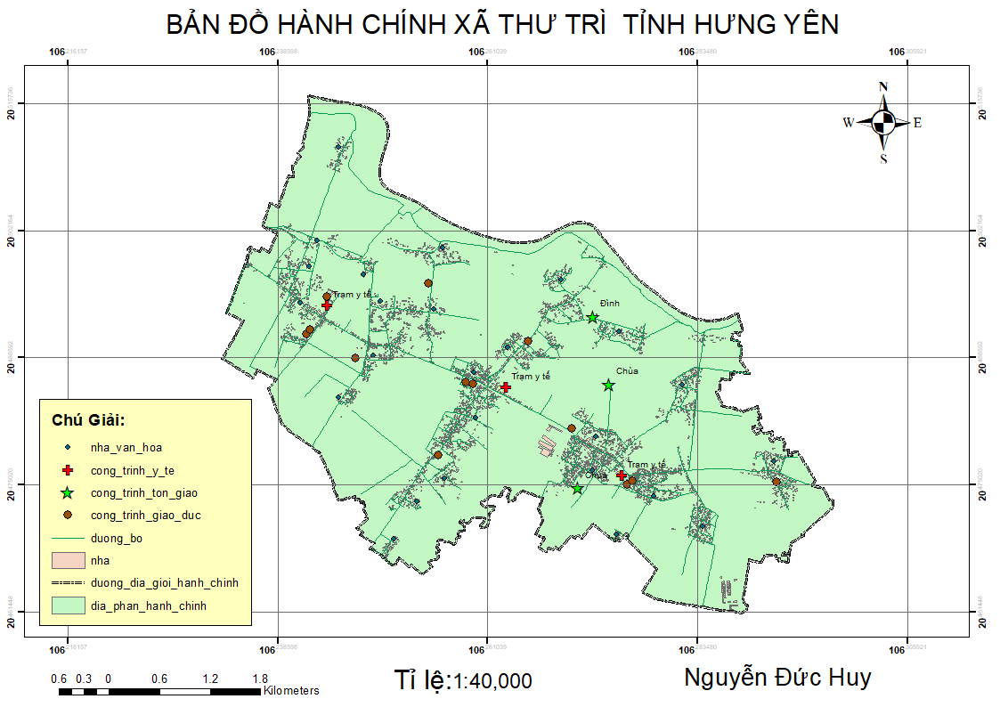
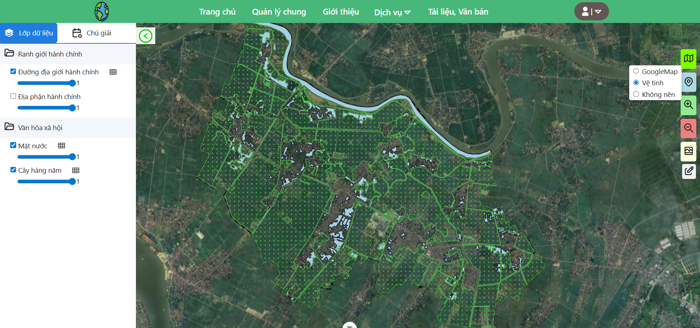

# Data and Map GIS

Dự án dữ liệu và biên tập bản đồ GIS phục vụ quản lý, cập nhật và khai thác dữ liệu không gian địa lý.

[📄 Xem PDF](D%E1%BB%8B%20N%E1%BA%ADu%20-%2063/map_.pdf)

## Công nghệ sử dụng
- QGIS, ArcGIS Pro, PostgreSQL/PostGIS, OpenLayers, GeoServer
---

## Quy trình biên tập và xây dựng bản đồ

### 1. Thu thập dữ liệu
- Thu thập dữ liệu nền địa lý, dữ liệu đo đạc và dữ liệu hiện trạng.
- Chuẩn hóa dữ liệu đầu vào từ nhiều nguồn khác nhau.

### 2. Chuẩn hóa dữ liệu không gian
- Kiểm tra hệ tọa độ.
- Chuyển đổi định dạng dữ liệu.
- Đồng bộ cấu trúc thuộc tính.

### 3. Biên tập dữ liệu bản đồ
- Số hóa đối tượng điểm, đường và vùng.
- Chỉnh sửa hình học đối tượng.
- Cập nhật thông tin thuộc tính.

### 4. Kiểm tra và làm sạch dữ liệu
- Kiểm tra topology.
- Kiểm tra dữ liệu trùng lặp.
- Kiểm tra tính đầy đủ và chính xác của thuộc tính.

### 5. Xây dựng cơ sở dữ liệu GIS
- Tổ chức dữ liệu theo lớp chuyên đề.
- Lưu trữ dữ liệu trong Geodatabase/PostGIS.
- Quản lý và cập nhật dữ liệu tập trung.

### 6. Thiết kế và hiển thị bản đồ
- Thiết lập ký hiệu bản đồ.
- Xây dựng nhãn và chú giải.
- Thiết kế bố cục bản đồ phục vụ in ấn và WebGIS.

### 7. Xuất bản và chia sẻ dữ liệu
- Publish dữ liệu lên GeoServer/WebGIS.
- Chia sẻ bản đồ trực tuyến.
- Hỗ trợ truy vấn và cập nhật dữ liệu.

---

## Hình ảnh minh họa

- triển khai dữ liệu GIS lên WebGIS

---

## Mục tiêu
- Quản lý dữ liệu không gian hiệu quả.
- Hỗ trợ cập nhật và khai thác dữ liệu GIS.
- Phục vụ xây dựng hệ thống WebGIS và bản đồ số.
